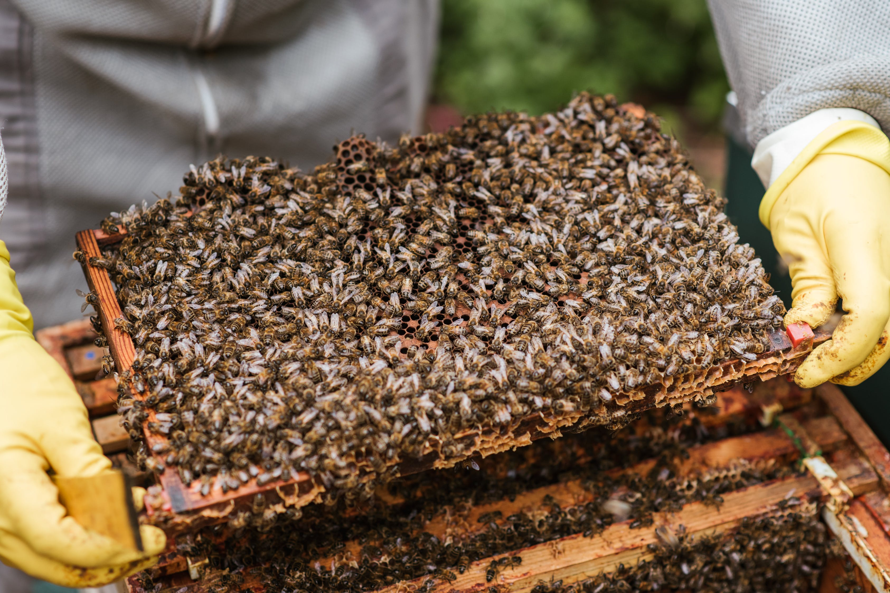
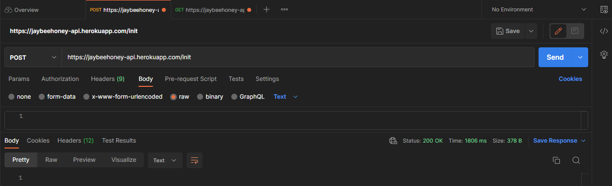
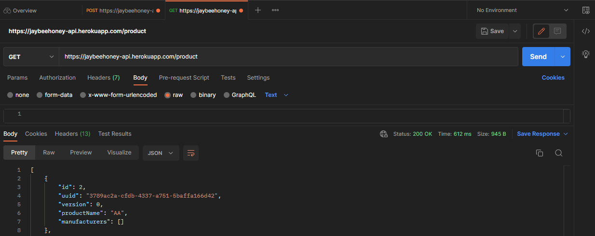
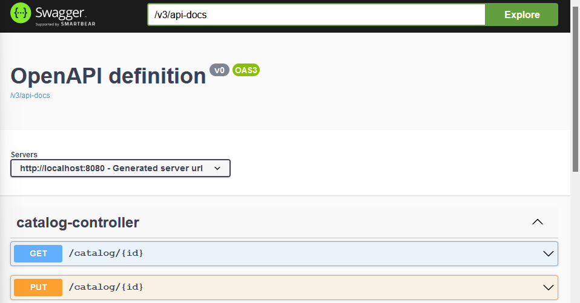

# JAYBEEHONEY-API

This is an interactive shop site, where you can buy honey related things.

Made by me, mostly for me. One day we may go live, cause my family owns a bee-garden. 

# Usage 💡

This API is responsible for eCommerce webshop BACKEND.
To use it you can send requests at the host :point_right: [https://jaybeehoney-api.herokuapp.com/](https://jaybeehoney-api.herokuapp.com/) 
**Please remember that this API is not meant to be used with your browser**  

Try (Heroku free tier apps sleep after 30 minutes of inactivity and need a minute to wake up): 
> curl -X POST https://jaybeehoney-api.herokuapp.com/init  

And then:
> curl -X GET https://jaybeehoney-api.herokuapp.com/product

Feel free to edit it and use it for your own eCommerce website. 🛒
Functions like ordering are already included!

## Postgres Database

This web application uses **local / Heroku** Postgres Database.

This API automatically connects to the local PostgreSQL using **Spring Profiles**.
When it gets deployed to Heroku it will use **prod profile** connecting to **Heroku PostgreSQL database**.

To run it locally, use:

1) cd docker (to get inside of /docker/ folder)
2) docker-compose up -d (to run our database configured in docker-compose.yml)
3) Open the API in your favorite IDE (I suggest IntelliJ 🤖 ) and run it!
4) The connection 🔗 will be established automatically using env from __docker-compose.yml__ 

## Swagger - API Documentation

The REST API was documented and can be found here: ~~https://rojberr.github.io/honey-swagger/~~ (deprecated, use the one stated below)
The documentation was created using SpringFox Boot Starter tool.

Another dependency was added, and not Swagger Honey API documentation can be accessed after launching the application
and typing: [http://localhost:8080/swagger-ui.html](http://localhost:8080/swagger-ui.html) in your browser address field. :)

## TODO

1) ...

## UML

## Changes

## Author

* rojberr - [drzymala.dev](https://drzymala.dev)